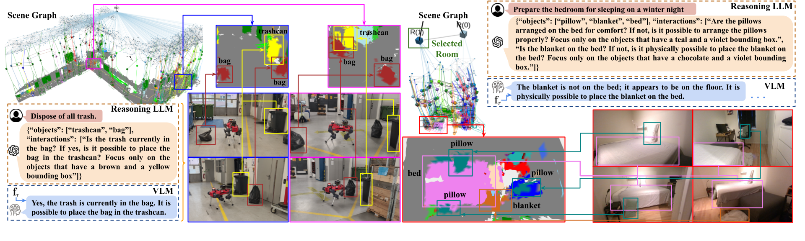

# <div align="center">Relationship-Aware Hierarchical 3D Scene Graph</div>

<div align="center">
  <a href=""></a>
  <a href=""></a>
  <a href=""></a>
</div>


This package implements an **enhanced hierarchical 3D scene graph** based on [Hydra](https://github.com/MIT-SPARK/Hydra/tree/main), integrating open-vocabulary features for rooms and objects, and supporting object-relational reasoning.  

We leverage a **Vision-Language Model (VLM)** to infer semantic relationships. Additionally, we introduce a **task reasoning module** that combines **Large Language Models (LLM)** and a VLM to interpret the scene graph’s semantic and relational information, enabling agents to reason about tasks and interact with their environment intelligently.

<div align="center">
    
</div>

---

## Table of Contents

- [Setup](#setup)  
  - [General Requirements](#general-requirements)  
  - [Building](#building)  
  - [Python Environment for Semantics and Reasoning](#python-environment-for-semantics-and-reasoning)  
- [Usage](#usage)  
  - [Scene Graph Construction](#scene-graph-construction)  
    - [Uhumans2 Dataset](#uhumans2)  
    - [Replica Dataset](#replica)  
    - [Habitat-Matterport 3D Semantics Dataset](#habitat-matterport-3d-semantics-dataset)  
    - [Robot Deployment](#robot)  
  - [Task Reasoning](#task-reasoning)  
- [Citation](#citation)  
- [License](#license)  
- [Acknowledgements](#acknowledgements)  
- [Contact](#contact)  

---

## Setup

### General Requirements

These instructions assume that `ros-noetic-desktop-full` is installed on **Ubuntu 20.04**.  

Install general dependencies:

```bash
sudo apt install python3-rosdep python3-catkin-tools python3-vcstool
```

### Building

Build the repository in **Release mode**:

```bash
mkdir -p catkin_ws/src
cd catkin_ws
catkin init
catkin config -DCMAKE_BUILD_TYPE=Release

cd src
git clone git@github.com:ntnu-arl/reasoning_hydra.git
vcs import . < reasoning_hydra/install/packages.repos
rosdep install --from-paths . --ignore-src -r -y

cd ..
catkin build
```

### Python Environment for Semantics and Reasoning

Follow the instructions in [semantic_inference_ros](https://github.com/ntnu-arl/semantic_inference_ros) to set up the Python environment required to run the semantic and reasoning models.

---

## Usage

### Scene Graph Construction

The system supports multiple datasets and online deployment on robots with GPU capabilities (e.g., **Nvidia Jetson Orin AGX**).

#### Uhumans2

Download rosbags from [Uhumans2 dataset](https://web.mit.edu/sparklab/datasets/uHumans2/).  

Start the scene graph:

```bash
roslaunch hydra_ros uhumans2.launch
```

In a separate terminal, play the rosbag:

```bash
rosbag play path/to/rosbag
```

#### Replica

Follow [NICE-SLAM instructions](https://github.com/cvg/nice-slam#replica-1) to download posed RGB-D data from Replica scenes.  

Run the scene graph:

```bash
roslaunch hydra_ros replica.launch
```

Publish the data:

```bash
roslaunch hydra_ros publish_replica.launch dataset_path:=<Path to your replica dataset> scene_name:=<Scene name>
```

#### Habitat-Matterport 3D Semantics Dataset

Follow [HOV-SG instructions](https://github.com/hovsg/HOV-SG?tab=readme-ov-file#habitat-matterport-3d-semantics) (Step 2 can be skipped) to download posed RGB-D data from several scenes.  

Run the scene graph:

```bash
roslaunch hydra_ros hm3dsem.launch
roslaunch hydra_ros publish_hm3dsem.launch dataset_path:=<Path to hm3d_trajectories> scene_name:=<Scene name>
```

#### Robot Deployment

To run the scene graph on your robot:

- Robot must provide posed RGB-D data as `sensor_msgs/Image`
- Pose must be provided via **TFs**

Update [robot.launch](./hydra_ros/launch/robot.launch) with the correct TFs and camera topic names, then run:

```bash
roslaunch hydra_ros robot.launch
```

We provide recorded data from experiments with an ANYMal robot. Download it [here](TODO).  

To use this data:

```bash
roslaunch hydra_ros robot.launch playback_mode:=True
```

Then play one of the downloaded rosbags:

```bash
rosbag play <bag_to_play> --topics /tf /camera/aligned_depth_to_color/image_raw/compressedDepth /camera/color/camera_info /camera/color/image_raw/compressed --clock
```

---

### Task Reasoning

The **reasoning module** (VLM + LLMs) requires an **internet connection**.  

- LLM queries are done via **OpenAI API**. 
- A large VLM is hosted externally (setup instructions: [semantic_inference_ros](https://github.com/ntnu-arl/semantic_inference_ros))

**IMPORTANT:** When using the reasoning module, set your OpenAI and FastAPI (see https://github.com/ntnu-arl/semantic_inference_ros) keys as environment variables before launching the ROS nodes: 
```bash
export OPENAI_API_KEY=<Your OpenAI API Key>
export FASTAPI_API_KEY=<Your server FastAPI Key>
```

Once the scene graph is constructed, either:

1. Use the provided **rviz GUI** to interact with the service and visualize task reasoning results on the scene graph.

2. Or call the [ROS service](https://github.com/ntnu-arl/semantic_inference_ros/blob/clean/semantic_inference_msgs/srv/NavigationPrompt.srv):  ```/semantic_inference/navigation_prompt_service/navigation_prompt```


---

## Citation

If you use this work in your research, please cite:

```bibtex
@article{puigjaner2025scenegraph,
  title={Relationship-Aware Hierarchical 3D Scene Graph for Task Reasoning},
  author={Gassol Puigjaner, Albert and Zacharia, Angelos and Alexis, Kostas},
  journal={ArXiv},
  year={2025},
}
```

---

## License

Released under **BSD-3-Clause**.

---

## Acknowledgements

This open-source release is based on work supported by the **European Commission** through:

- **Project SYNERGISE**, under **Horizon Europe Grant Agreement No. 101121321**

---

## Contact

For questions or support, reach out via [GitHub Issues](https://github.com/ntnu-arl/reasoning_hydra/issues) or contact the authors directly:

- [Albert Gassol Puigjaner](mailto:albert.g.puigjaner@ntnu.no)  
- [Angelos Zacharia](mailto:angelos.zacharia@ntnu.no)  
- [Kostas Alexis](mailto:konstantinos.alexis@ntnu.no)

